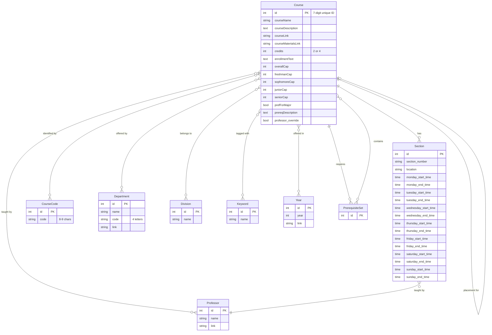

# Amherst Coursework - Advanced Course Search & Planning

[](https://github.com/ac-i2i-engineering/amherst-coursework/actions/workflows/django.yml) [](https://coveralls.io/github/ac-i2i-engineering/amherst-coursework)  [](https://github.com/psf/black)

Amherst Coursework is a sophisticated web application that provides Amherst College students and faculty with an intuitive, advanced interface for course search and schedule planning. Built with Django and powered by intelligent search algorithms, it transforms the course selection experience with natural language search, synonym expansion, conflict detection, and visual schedule management.

## Key Features

- **Intelligent Search Engine:** Advanced weighted scoring algorithm with TF-IDF similarity, synonym expansion, location-based matching, and context-aware ranking for highly relevant course results
- **Natural Language Queries:** Students can search using natural language like "learn to code" or "climate change" and get relevant results
- **Smart Synonym Expansion:** Automatically expands terms like "coding" → "programming", "movies" → "film" for better matching
- **Interactive Schedule Builder:** Visual course cart with real-time conflict detection, calendar visualization, and total credit tracking
- **Comprehensive Course Details:** Detailed information including prerequisites, corequisites, enrollment caps, class year limits, course tags, semester offerings, and clickable professor links
- **AI-Powered Course Advisor:** Intelligent course recommendations powered by Google's Gemini, providing personalized guidance based on your academic interests, goals, and schedule
- **Automated Data Pipeline:** Fully automated web scraping and database updates twice yearly
- **Responsive Design:** Clean, modern interface optimized for desktop and mobile devices
- **Flexible Search:** Works with course codes, department names, professor names, topics, building locations, or natural language

## Getting Started

To clone and set up the application locally, follow the instructions below.

### Clone the Repository

```bash
git clone https://github.com/ac-i2i-engineering/amherst-coursework.git
cd amherst-coursework
```

### Set Up a Virtual Environment

Create and activate a virtual environment to manage dependencies locally.

```bash
python3 -m venv env
source env/bin/activate
```

### Install Dependencies

```bash
pip install -r requirements.txt
```

### Run Database Migrations

Navigate to the backend directory and apply migrations to set up the database schema.

```bash
cd amherst_coursework_backend
python manage.py makemigrations
python manage.py migrate
```

### Load Course Data (Optional)

If you want to populate the database with course data:

```bash
# Run the complete scraping pipeline (takes ~10-15 minutes)
python manage.py course_parser_setup
python manage.py get_all_department_courses
python manage.py parse_deg_1
python manage.py parse_deg_2
python manage.py load_courses parsed_courses_second_deg.json
```

### Start the Development Server

To run the application locally, use the following command:

```bash
python manage.py runserver
```

Visit `http://127.0.0.1:8000/` in your browser to view the application.

## System Architecture & Design

Amherst Coursework is designed with a modular, scalable architecture that separates data ingestion, processing, and presentation layers. Below is a high-level overview of the system components and their interactions.

### Architecture Overview


### Data Model Architecture

The application uses a relational database with 9 interconnected models:



### Course ID Structure

Courses use a unique 7-digit identifier with embedded metadata:

```
Format: XYYZCZZ

X   = Semester (4=Fall, 5=Spring)
YY  = Department Code (00-99)
Z   = Credit Flag (0=Full, 1=Half)
CZZ = Course Number (000-999)

Example: 4140112
  4   = Fall semester
  14  = Computer Science department
  0   = Full credit (4 credits)
  112 = Course number 112
  → COSC-112 (Fall, Full Credit)
```

## Functional Design & Data Flow

The following diagram illustrates the complete data pipeline from course catalog scraping to user interaction:


### Search Algorithm Workflow

The search engine uses a sophisticated multi-stage algorithm:


### User Interaction Flow


## Technology Stack

### Backend
- **Framework:** Django 5.1.7 (Python 3.10+)
- **Database:** SQLite3 (2.3 MB)
- **ORM:** Django ORM with prefetch optimization
- **Web Scraping:** BeautifulSoup4, Requests
- **Machine Learning:** scikit-learn (TF-IDF, cosine similarity)
- **NLP:** NLTK (stop words, tokenization)
- **Static Files:** WhiteNoise
- **CORS:** django-cors-headers

### Frontend
- **Templates:** Django Template Language
- **JavaScript:** Vanilla ES6+ (no frameworks)
- **CSS:** Custom CSS with Grid/Flexbox
- **Icons:** Font Awesome
- **Storage:** Browser localStorage

### Development & Testing
- **Testing:** pytest, pytest-django, pytest-cov
- **Coverage:** Coveralls integration
- **Code Formatting:** Black
- **Pre-commit Hooks:** black, trailing whitespace
- **Documentation:** Sphinx with Wagtail theme
- **CI/CD:** GitHub Actions

### Deployment
- **Platform:** Render.com
- **WSGI Server:** Gunicorn
- **Environment:** Python 3.10+ runtime
- **Automation:** GitHub Actions (twice yearly updates)

## Project Structure

```
amherst-coursework/
├── amherst_coursework_backend/          # Django project root
│   ├── amherst_coursework_backend/      # Project settings
│   │   ├── settings.py                  # Django configuration
│   │   ├── urls.py                      # Root URL routing
│   │   └── wsgi.py                      # WSGI application
│   │
│   ├── amherst_coursework_algo/         # Main Django app
│   │   ├── models.py                    # 9 data models
│   │   ├── views.py                     # View functions
│   │   ├── urls.py                      # App URL patterns
│   │   ├── admin.py                     # Admin interface
│   │   ├── masked_filters.py            # Search algorithm
│   │   │
│   │   ├── management/commands/         # CLI commands
│   │   │   ├── course_parser_setup.py   # Stage 1: Discover departments
│   │   │   ├── get_all_department_courses.py  # Stage 2: Collect URLs
│   │   │   ├── parse_deg_1.py           # Stage 3: Basic parsing
│   │   │   ├── parse_deg_2.py           # Stage 4: Section parsing
│   │   │   └── load_courses.py          # Stage 5: Database loading
│   │   │
│   │   ├── parse_course_catalogue/      # Scraping utilities
│   │   │   ├── course_parser.py         # HTML parsing logic
│   │   │   └── course_scraper.py        # HTTP request handling
│   │   │
│   │   ├── config/                      # Configuration data
│   │   │   └── course_dictionaries.py   # Department mappings
│   │   │
│   │   ├── data/                        # Scraped JSON files
│   │   │   ├── department_catalogue_links.json
│   │   │   ├── all_department_courses.json
│   │   │   ├── parsed_courses_detailed.json
│   │   │   └── parsed_courses_second_deg.json
│   │   │
│   │   ├── templates/                   # HTML templates
│   │   │   ├── home.html                # Main search page
│   │   │   ├── course_details.html      # Details panel
│   │   │   └── base.html                # Base template
│   │   │
│   │   ├── static/                      # Static assets
│   │   │   ├── css/                     # Stylesheets
│   │   │   ├── js/                      # JavaScript
│   │   │   └── images/                  # Images
│   │   │
│   │   └── templatetags/                # Custom template filters
│   │       └── course_filters.py
│   │
│   ├── amherst_coursework_tests/        # Test suite
│   │   ├── test_models.py               # Model tests
│   │   ├── test_commands.py             # Command tests
│   │   └── test_search_filter.py        # Search algorithm tests
│   │
│   ├── db.sqlite3                       # SQLite database
│   ├── manage.py                        # Django CLI
│   └── pytest.ini                       # Pytest configuration
│
├── docs/                                # Sphinx documentation
│   ├── source/                          # RST source files
│   │   ├── index.rst                    # Documentation home
│   │   ├── models.rst                   # Model documentation
│   │   ├── filters.rst                  # Search algorithm docs
│   │   └── course_parser.rst            # Parser documentation
│   ├── Makefile                         # Build commands
│   └── requirements.txt                 # Doc dependencies
│
├── .github/workflows/                   # CI/CD pipelines
│   ├── django.yml                       # Test & coverage
│   ├── sphinx.yml                       # Documentation build
│   └── parse_courses.yml                # Automated scraping
│
├── .devcontainer/                       # Dev container config
├── .gitpod.yml                          # Gitpod configuration
├── .pre-commit-config.yaml              # Pre-commit hooks
├── .readthedocs.yml                     # ReadTheDocs config
├── requirements.txt                     # Python dependencies
├── pyproject.toml                       # Black configuration
├── LICENSE                              # MIT License
└── README.md                            # This file
```

## Search Algorithm Details

### Scoring Weights

The search algorithm uses configurable weights to rank courses:

| Component | Weight | Description |
|-----------|--------|-------------|
| Course Name | 100 | Matches in course title |
| Course Name (Exact) | +150 | Bonus for exact word match |
| Course Code | 90 | Matches in course codes (e.g., COSC-111) |
| Course Code (Exact) | +300 | Bonus for exact code match |
| Department Name | 120 | Matches in department name |
| Department Code | 150 | Matches in department code |
| Division | 8 | Matches in academic division (reduced to prevent generic matches) |
| Keyword | 70 | Matches in course keywords |
| Description | 60 | Matches in course description |
| Professor | 130 | Matches in professor names |
| Half Course | 200 | Bonus for "half" keyword |
| Location Match | 200 | Matches in section building location (3+ chars, excludes pure numbers) |
| TF-IDF Similarity | 120 | Cosine similarity score for semantic matching |
| Phrase Match | 80 | Bonus for multi-word phrase matches |

### Search Features

#### 1. Synonym Expansion
Automatically expands common terms for better matching:
- **"coding"** → "programming", "computer science", "software"
- **"code"** → "programming", "computer science"
- **"climate"** → "environmental", "climate change", "global warming"
- **"movies"** → "film", "cinema"

**Example:** Searching "coding" now returns 28 CS courses instead of 1!

#### 2. Abbreviation Expansion
Expands technical abbreviations bidirectionally:
- **"AI"** ↔ "artificial intelligence"
- **"ML"** ↔ "machine learning"
- **"NLP"** ↔ "natural language processing"

#### 3. Introductory Course Boosting
Detects beginner intent and boosts intro courses:
- Keywords: "intro", "introduction", "beginner", "start"
- Applies 1.5x boost to introductory courses
- Helps students find entry points into new subjects

#### 4. Context-Aware Penalties
Smart scoring adjustments based on query context:
- **STEM Boost:** 1.3x-1.5x for STEM courses in STEM queries
- **Social Science Penalty:** 0.25x for social sciences in STEM queries
- **Generic Course Penalty:** 0.5x for courses in 4+ divisions

#### 5. Result Quality Controls
- **Score Cutoff:** 25% of highest score (filters low-relevance results)
- **Max Results:** Limited to 100 courses (prevents overwhelming users)
- **Phrase Detection:** 2-3 word phrases get bonus scoring

### Query Examples

| Query Type | Example | Top Result |
|------------|---------|------------|
| Course Code | "COSC-111" | Introduction to Computer Science I |
| Department | "Computer Science" | 18 CS courses |
| Professor | "Flanagan" | Courses taught by Abby Flanagan |
| Natural Language | "learn to code" | Introduction to Computer Science I |
| Skills | "coding" | 28 programming courses |
| Topics | "climate change" | 12 environmental courses |
| Interests | "creative writing" | 20 writing courses |

## API Endpoints

### Public Endpoints

| Method | Endpoint | Description | Response |
|--------|----------|-------------|----------|
| GET | `/` | Home page with search | HTML |
| GET | `/?search={query}` | Search courses | HTML |
| GET | `/?search={query}&page={n}` | Paginated search | HTML |
| GET | `/details/{course_id}/` | Course details panel | HTML partial |
| GET | `/cart-courses/?cart=[...]` | Cart course data | JSON |
| GET | `/api/course/{course_id}/` | Course metadata | JSON |
| GET | `/api/course/{course_id}/sections/` | Course sections | JSON |

### Example API Response

```json
{
  "id": 4140112,
  "courseName": "Introduction to Computer Science",
  "courseCodes": ["COSC-111"],
  "departments": ["Computer Science"],
  "divisions": ["Science & Mathematics"],
  "credits": 4,
  "courseDescription": "An introduction to computer science...",
  "professors": ["Professor Smith"],
  "sections": [
    {
      "section_number": "01",
      "location": "SMUD 206",
      "professor": "Professor Smith",
      "monday_start_time": "09:00:00",
      "monday_end_time": "09:50:00",
      "wednesday_start_time": "09:00:00",
      "wednesday_end_time": "09:50:00",
      "friday_start_time": "09:00:00",
      "friday_end_time": "09:50:00"
    }
  ]
}
```

## Testing

Run the test suite with pytest:

```bash
# Run all tests
pytest

# Run with coverage report
pytest --cov=amherst_coursework_algo

# Run specific test file
pytest amherst_coursework_backend/amherst_coursework_tests/test_models.py

# Run with verbose output
pytest -v
```

### Test Coverage

The project maintains high test coverage:
- **Models:** Unit tests for all 9 models
- **Search Algorithm:** Comprehensive filter tests
- **Management Commands:** Parser and loader tests
- **Views:** Integration tests for all endpoints

## Contributing

We welcome contributions to improve Amherst Coursework. Please follow these guidelines:

### Code Formatting

Ensure your code adheres to the `black` style guidelines. You can format your code by running:

```bash
python -m black ./
```

A pre-commit hook is set up to enforce this format automatically.

### Documentation

For adding or updating documentation, please refer to the [Amherst Coursework Backend Documentation Guide](./docs/README.md) in `docs/`. It includes instructions on:
- Using Sphinx to document models and views
- Creating `.rst` files
- Building and previewing documentation

### Pull Requests

Before submitting a pull request, ensure that:
1. All code is well-documented with docstrings
2. Tests are written for new features
3. All tests pass (`pytest`)
4. Code is formatted with Black
5. Commit messages follow conventional commit format

### Development Workflow

1. Fork the repository
2. Create a feature branch (`git checkout -b feature/amazing-feature`)
3. Make your changes
4. Run tests and formatting (`pytest && black .`)
5. Commit your changes (`git commit -m 'Add amazing feature'`)
6. Push to the branch (`git push origin feature/amazing-feature`)
7. Open a Pull Request

## Performance Considerations

### Current Optimizations

- **Database Queries:** `prefetch_related()` and `select_related()` for efficient joins
- **Pagination:** 40 courses per page to reduce load time
- **Client-Side Cart:** localStorage prevents unnecessary server requests
- **Static Files:** WhiteNoise compression and caching
- **Lazy Loading:** Course details loaded on-demand via AJAX

### Scalability Recommendations

For larger deployments, consider:
- **PostgreSQL:** Replace SQLite for better concurrency
- **Redis:** Add caching layer for search results
- **Celery:** Async task processing for scraping
- **CDN:** Serve static assets from CDN
- **Load Balancer:** Horizontal scaling with multiple servers

## Automated Maintenance

### Course Data Updates

The application automatically updates course data twice yearly:
- **April 1:** Spring semester courses
- **November 1:** Fall semester courses

This is handled by GitHub Actions workflow (`.github/workflows/parse_courses.yml`).

### Manual Update

To manually trigger a course data update:

```bash
# Run the complete pipeline
python manage.py course_parser_setup && \
python manage.py get_all_department_courses && \
python manage.py parse_deg_1 && \
python manage.py parse_deg_2 && \
python manage.py load_courses parsed_courses_second_deg.json
```


## AI Course Advisor

The AI Course Advisor is an intelligent assistant that helps students discover courses aligned with their academic interests and goals. Powered by Google's Gemini AI, it provides personalized course recommendations with detailed explanations.

### Features

- **Personalized Recommendations:** Get course suggestions tailored to your interests, major, and academic goals
- **Intelligent Context Understanding:** The advisor considers your current schedule, completed courses, and academic level
- **Detailed Explanations:** Each recommendation includes reasoning about why the course matches your interests
- **Natural Conversation:** Ask follow-up questions and refine recommendations through natural dialogue
- **Course Integration:** Recommended courses link directly to full course details and can be added to your schedule

### Setup

To enable the AI Advisor feature, you need a Google Gemini API key:

1. **Get a Google Gemini API Key:**
   - Visit [https://aistudio.google.com/apikey](https://aistudio.google.com/apikey)
   - Sign up or log in to your Google account
   - Create a new API key

2. **Configure the Application:**
   
   Create a `.env` file in the `amherst_coursework_backend` directory:
   
   ```bash
   cd amherst_coursework_backend
   touch .env
   ```
   
   Add your API key to the `.env` file:
   
   ```
   GEMINI_API_KEY=your_api_key_here
   ```

3. **Install Required Dependencies:**
   
   The Google GenAI Python library is required. Install all dependencies:
   
   ```bash
   pip install -r requirements.txt
   pip install google-genai
   ```

4. **Verify Setup:**
   
   The application will automatically detect the API key. If the key is missing or invalid, the AI Advisor button will be disabled with a helpful error message.

### Usage

1. **Access the Advisor:**
   - Click the "AI Course Advisor" button in the navigation bar
   - A modal dialog will open with the advisor interface

2. **Start a Conversation:**
   - Describe your interests, goals, or what you're looking for in a course
   - Examples:
     - "I'm interested in machine learning and data science"
     - "I want to take a creative writing course"
     - "What courses would help me prepare for medical school?"
     - "I'm looking for courses about climate change and sustainability"

3. **Review Recommendations:**
   - The advisor will suggest relevant courses with explanations
   - Each course includes:
     - Course code and title
     - Department and credits
     - Why it matches your interests
     - Link to full course details

4. **Refine Your Search:**
   - Ask follow-up questions to narrow down recommendations
   - Provide additional context about your schedule or preferences
   - Request alternatives or more specific suggestions

5. **Add to Schedule:**
   - Click on any recommended course to view full details
   - Add courses directly to your cart from the course detail page

### How It Works

The AI Advisor uses a sophisticated multi-step process:

1. **Context Building:**
   - Retrieves all available courses from the database
   - Formats course information including titles, descriptions, departments, and prerequisites
   - Builds a comprehensive context about the course catalog

2. **Intelligent Processing:**
   - Sends your query along with course data to Google Gemini
   - Uses structured prompts to ensure relevant, accurate recommendations
   - Maintains conversation history for contextual follow-ups

3. **Response Formatting:**
   - Parses AI responses into structured course recommendations
   - Extracts course codes, titles, and reasoning
   - Links recommendations to actual course database entries

4. **Interactive Refinement:**
   - Maintains conversation state across multiple queries
   - Allows natural back-and-forth dialogue
   - Adapts recommendations based on your feedback

### Technical Architecture


**Key Components:**

- **Frontend (`advisor.js`):**
  - Modal interface with chat-like experience
  - Real-time message display with typing indicators
  - Course card rendering with links to details
  - Conversation history management

- **Backend (`ai_advisor.py` and `views.py`):**
  - `ai_advisor` endpoint handles all advisor requests
  - Retrieves course data from database
  - Manages Google Gemini API communication
  - Parses and structures AI responses

- **API Integration:**
  - Uses Google's GenAI SDK
  - Gemini Flash model for fast, high-quality recommendations
  - Structured system prompts for consistent output
  - Error handling and fallback responses

### API Endpoint

**Endpoint:** `POST /api/ai-advisor/`

**Request Body:**
```json
{
  "message": "I'm interested in computer science and artificial intelligence",
  "conversation_history": [
    {
      "role": "user",
      "content": "Previous user message"
    },
    {
      "role": "assistant",
      "content": "Previous assistant response"
    }
  ]
}
```

**Response:**
```json
{
  "response": "Based on your interest in AI, I recommend...",
  "courses": [
    {
      "code": "COSC-311",
      "title": "Theory of Computation",
      "department": "Computer Science",
      "credits": 4.0,
      "reasoning": "This course provides foundational knowledge..."
    }
  ]
}
```

**Error Response:**
```json
{
  "error": "GEMINI_API_KEY not configured in settings"
}
```

### Troubleshooting

**Issue: "AI Advisor is not available" message**
- **Cause:** Gemini API key is not configured
- **Solution:** Follow the setup instructions above to add your API key to `.env`

**Issue: Slow response times**
- **Cause:** Gemini API calls can take 3-8 seconds depending on query complexity
- **Solution:** This is normal; the loading indicator shows progress

**Issue: Generic or irrelevant recommendations**
- **Cause:** Query may be too vague or broad
- **Solution:** Provide more specific details about your interests, major, or goals

**Issue: "Error communicating with AI service"**
- **Cause:** API key invalid, rate limit exceeded, or network issues
- **Solution:** 
  - Verify your API key is correct
  - Check your Google AI Studio account for rate limits or quota issues
  - Ensure you have internet connectivity

**Issue: Recommended courses don't exist**
- **Cause:** AI may occasionally suggest courses not in the current catalog
- **Solution:** The system filters recommendations to only show existing courses

### Best Practices

1. **Be Specific:** Provide detailed information about your interests and goals
2. **Iterate:** Use follow-up questions to refine recommendations
3. **Provide Context:** Mention your major, year, or completed courses for better suggestions
4. **Explore:** Don't hesitate to ask about different topics or interdisciplinary interests
5. **Verify:** Always check full course details before adding to your schedule

### Privacy & Data

- Conversations are not stored permanently
- Only course catalog data and your queries are sent to Google Gemini
- No personal information or academic records are transmitted
- API usage follows Google's Generative AI data usage policies


## License

This project is licensed under the MIT License - see the [LICENSE](LICENSE) file for details.

## Acknowledgments

This project is made possible through the **i2i (Ideas 2 Innovation)** initiative, a student-led venture accelerator at Amherst College.

### Contributors

- Development Team: Amherst College i2i Engineering
- Course Data: Amherst College Registrar
- Testing & QA: Amherst College Students

## Support

For questions, issues, or feature requests:
- **GitHub Issues:** [Report a bug or request a feature](https://github.com/ac-i2i-engineering/amherst-coursework/issues)
- **Documentation:** [Read the full documentation](https://amherst-coursework.readthedocs.io/)
- **Email:** Contact the i2i Engineering team

---

**Made with ❤️ by Amherst College students, for Amherst College students.**